This is an adaptation of joshnewans/my_bot (uses amend that is the building tool for ROS2), suing cmake (ROS1)
Important to know: 
 -) ROS Transform System (TF): https://www.youtube.com/watch?v=QyvHhY4Y_Y8
To build the package:
    In catkin_ws, execute "catkin_make_isolated"
    
To launch the robot:
    !! Always source /home/fede/DRL-obstacle-avoidance/catkin_ws/
    devel_isolated/setup.bash
    python3 src/wheelchair_robot/launch/robot.gazebo.launch.py

N.B: when adding new files, always "catkin_make_isolated"
Useful info about ROS:
    roscore: -> to start the master node
    rospack: find and retrieve information about packages (list)
    killall -9 rosout roslaunch rosmaster gzserver nodelet robot_state_publisher gzclient python python3 -> to kill nodes belonging to ros

How URDF works:

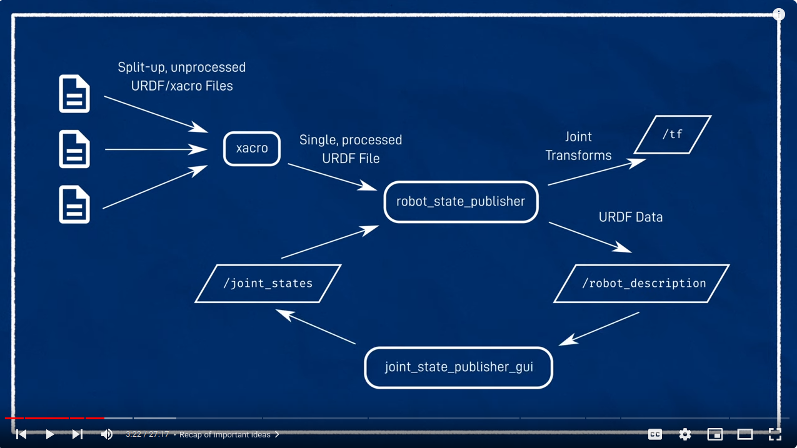

The URDF files are parsed and compacted into a single file by xacro program. The result is given as input to another program called "robot_state_publisher" which let the URDF file be visible on the topic /robot_description so as the joint transform on the /tf topic. 
The robot_state_publisher expects input of movable joints on /joint_states topic.
For testing purpose, we can fake the movement by changing the joint using the "joint_state_publisher_gui"

For the robot, by convention the first link is always called "base_link" and, for differential driver robot, its position is between the two rotational wheels (kaes the calculation easier because it is also the center of rotation instead of the centre of the chassis - in picture a box)

NB: the hint is to model the visual first, then add the collision afterwards since just a mere copy&paste of visual w/o material.
For inertial, use the xacro file (use formulas of main block from wikepedia)

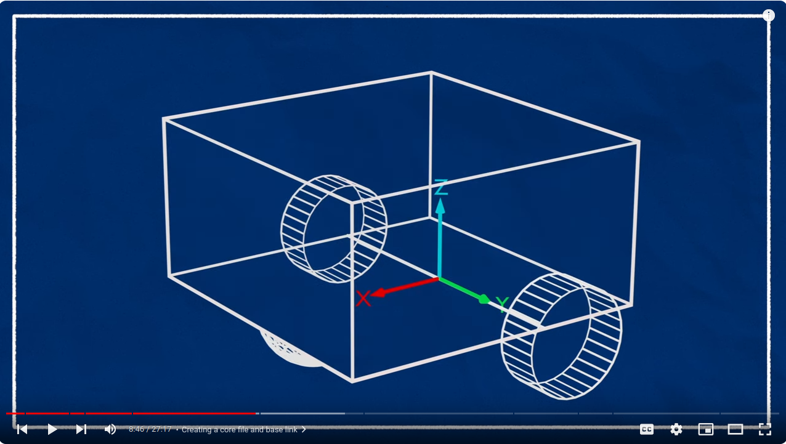

The chassis origin is often placed just behind the centre of the base_link

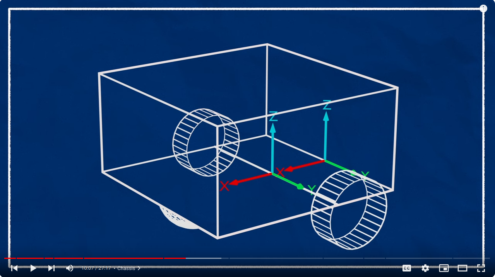

When we create the chassis visual, by default it is centred in the origin of the chassis itself (decided by the joint). For this reason, we need to shift the visual forward and upward to make it looking nicer.

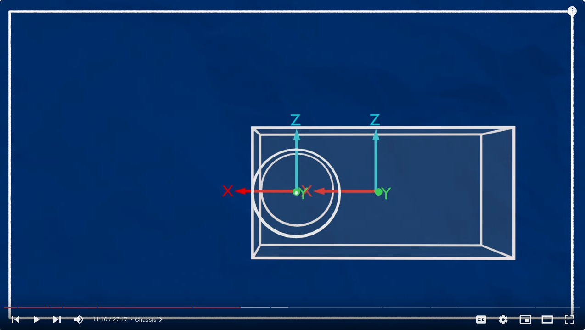
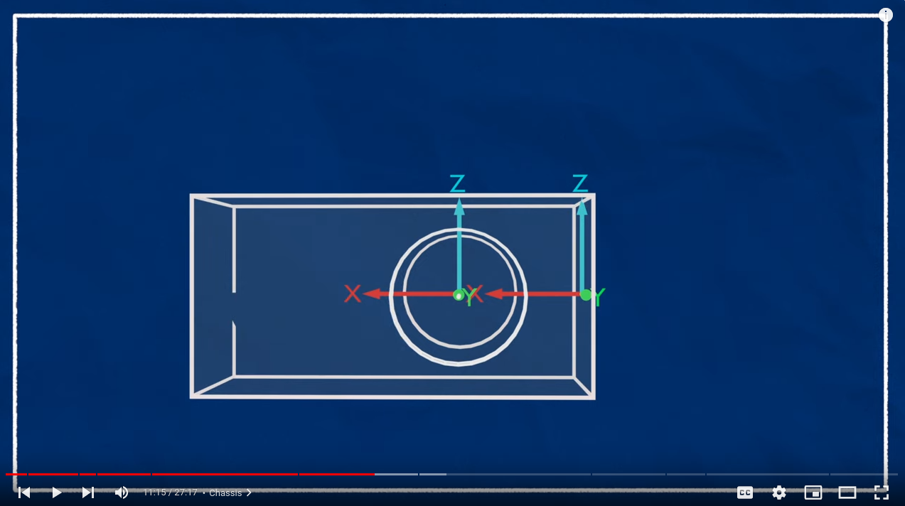
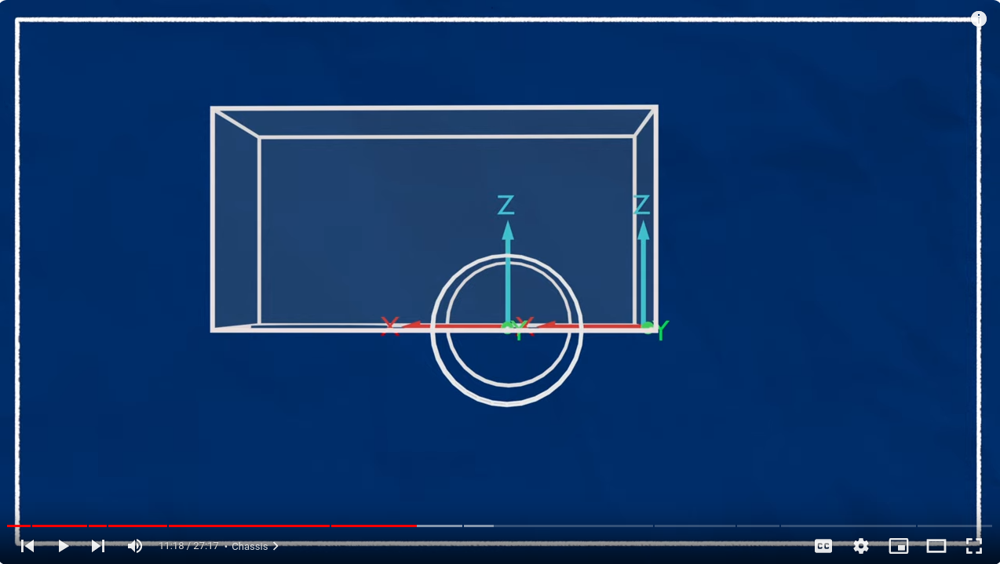

By default, cylinders (our wheels) are oriented as the following
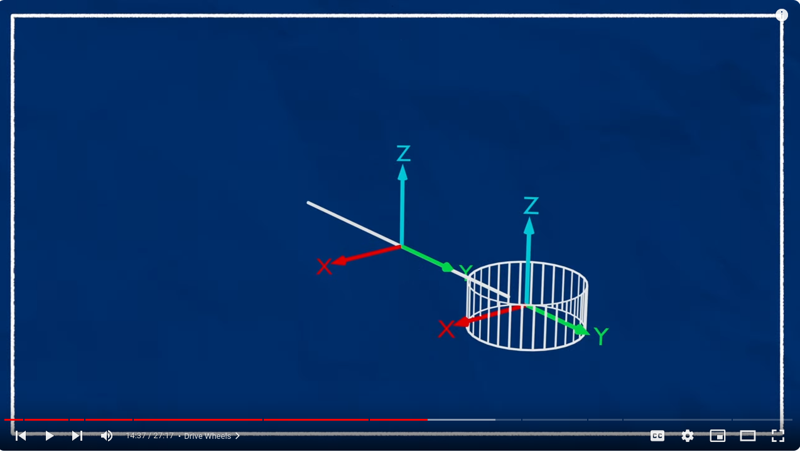
For this reason, we need to turn them like in the picture
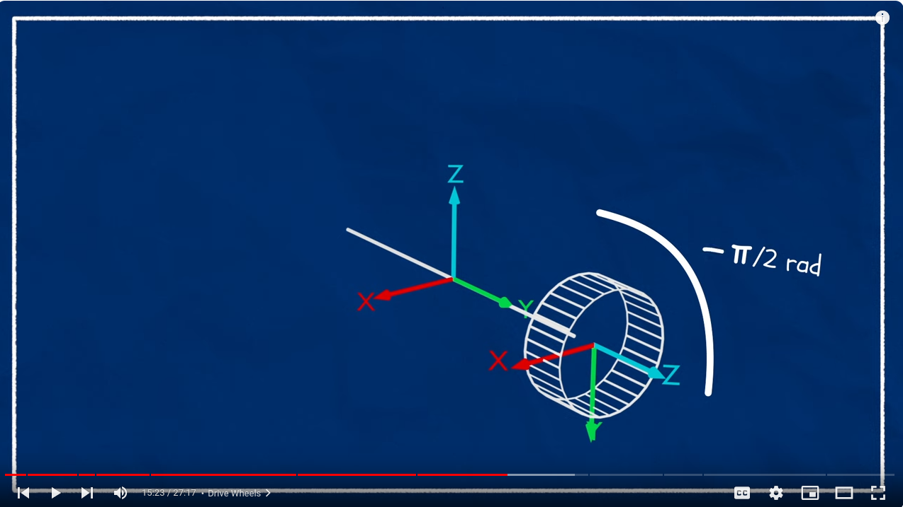

To make the robot be a differential driving robot, we need to add a castor wheel in front, able to rotate in every direction.
Since the parent link is the chassis, it originates on chassis' origin.
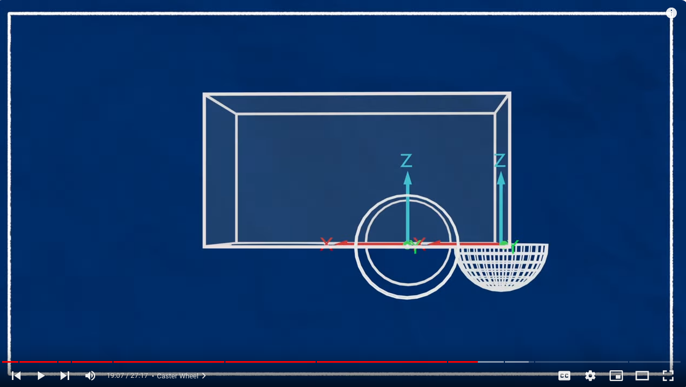
For this reason, we need to shift it
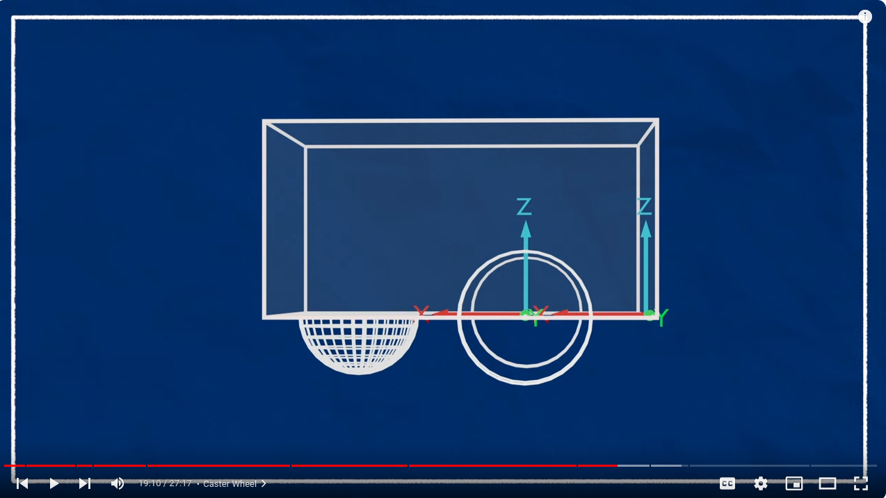

Thanks to a plugin for gazebo (ros_diff) we are able to control the robot movement
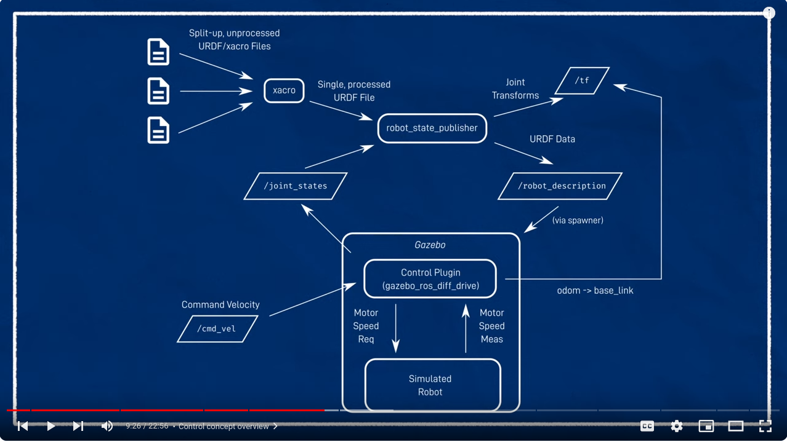

For lidar, ros provides a message called "sensor_msgs/LaserScan" that abstract the manifacturer of the lidar. The only thing that changes is the driver attached to the lidar.

Once the launch file has been executed, open Rviz and:
-) set fixed frame = "base_link"
-) add TF
-) add RobotModel (take input from /robot_descritpion)
-) rosrun joint_state_publisher_gui joint_state_publisher_gui -> to simulated the movement of the rotational joints (in our case the wheels joint)
-) tosimulate cmd/vel -> rosrun teleop_twist_keyboard teleop_twist_keyboard.py

To launch a test:
in catkin:
-) python3 src/wheelchair_robot/launch/robot.gazebo.launch.py <world_name>

For submodules:
https://git-scm.com/book/en/v2/Git-Tools-Submodules